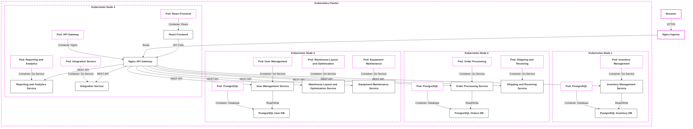

```mermaid
graph TD;
    client[<b>Browser</b>] -->|HTTPS| ingress[<b>Nginx Ingress</b>]

    subgraph Kubernetes_Cluster["<b>Kubernetes Cluster</b>"]
        subgraph Node1["<b>Kubernetes Node 1</b>"]
            pod1[<b>Pod: Inventory Management</b>]
            pod1 -->|Container: Go Service| inventory[<b>Inventory Management Service</b>]
            pod1_db[<b>Pod: PostgreSQL</b>]
            pod1_db -->|Container: Database| db1[<b>PostgreSQL Inventory DB</b>]
        end

        subgraph Node2["<b>Kubernetes Node 2</b>"]
            pod2[<b>Pod: Order Processing</b>]
            pod2 -->|Container: Go Service| orders[<b>Order Processing Service</b>]
            pod2_db[<b>Pod: PostgreSQL</b>]
            pod2_db -->|Container: Database| db2[<b>PostgreSQL Orders DB</b>]

            pod6[<b>Pod: Shipping and Receiving</b>]
            pod6 -->|Container: Go Service| shipping[<b>Shipping and Receiving Service</b>]
        end

        subgraph Node3["<b>Kubernetes Node 3</b>"]
            pod3[<b>Pod: User Management</b>]
            pod3 -->|Container: Go Service| userMgmt[<b>User Management Service</b>]
            pod3_db[<b>Pod: PostgreSQL</b>]
            pod3_db -->|Container: Database| db3[<b>PostgreSQL User DB</b>]

            pod7[<b>Pod: Warehouse Layout and Optimization</b>]
            pod7 -->|Container: Go Service| layout[<b>Warehouse Layout and Optimization Service</b>]

            pod8[<b>Pod: Equipment Maintenance</b>]
            pod8 -->|Container: Go Service| maintenance[<b>Equipment Maintenance Service</b>]
        end

        subgraph Node4["<b>Kubernetes Node 4</b>"]
            pod4[<b>Pod: API Gateway</b>]
            pod4 -->|Container: Nginx| apiGateway[<b>Nginx API Gateway</b>]

            pod4_frontend[<b>Pod: React Frontend</b>]
            pod4_frontend -->|Container: React| react[<b>React Frontend</b>]

            pod5[<b>Pod: Reporting and Analytics</b>]
            pod5 -->|Container: Go Service| reporting[<b>Reporting and Analytics Service</b>]

            pod9[<b>Pod: Integration Service</b>]
            pod9 -->|Container: Go Service| integration[<b>Integration Service</b>]
        end
    end

    ingress -->|Route| apiGateway

    apiGateway -->|REST API| inventory
    apiGateway -->|REST API| orders
    apiGateway -->|REST API| shipping
    apiGateway -->|REST API| layout
    apiGateway -->|REST API| maintenance
    apiGateway -->|REST API| userMgmt
    apiGateway -->|REST API| reporting
    apiGateway -->|REST API| integration

    inventory -->|Read/Write| db1
    orders -->|Read/Write| db2
    userMgmt -->|Read/Write| db3

    react -->|API Calls| apiGateway

    classDef cluster fill:#fff,stroke:#f0f,stroke-width:2px,stroke-dasharray: 5, 5;
    classDef node fill:#fff,stroke:#f0f,stroke-width:2px;
    classDef pod fill:#fff,stroke:#f0f,stroke-width:1px;
    classDef service fill:#fff,stroke:#000,stroke-width:1px;
    classDef database fill:#fff,stroke:#000,stroke-width:1px;
    classDef frontend fill:#fff,stroke:#000,stroke-width:1px;
    classDef web fill:#fff,stroke:#f0f,stroke-width:2px;
    classDef arrowheads stroke:#333,stroke-width:1px,fill:#fff;

    class Kubernetes_Cluster,Node1,Node2,Node3,Node4 cluster;
    class pod1,pod1_db,pod2,pod2_db,pod3,pod3_db,pod4,pod4_frontend,pod5,pod6,pod7,pod8,pod9 pod;
    class inventory,orders,shipping,layout,maintenance,userMgmt,reporting,integration,apiGateway,db1,db2,db3 service;
    class react frontend;
    class ingress web;
```
